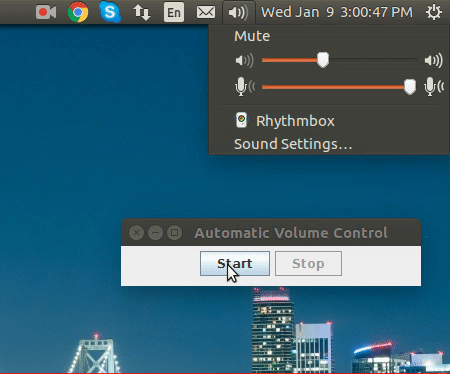

[](https://github.com/sugandhitushar/automatic-volume-control/blob/master/LICENSE)

# Automatic Volume Control

Description - Controls the volume of speaker based on amplitude of mic input. Minimum threshold is system's volume at the start of the program and maximum is system's max volume. 

**Output -**



**Execution Steps -** 

Download the AutomaticVolumeControl.jar file and execute it using below command
```
java -jar AutomaticVolumeControl.jar
```

OR 


1. Compile all java files from src and keep them besides manifest.txt file.
```
javac -d . src/*
```

2. Execute below command to create an executable JAR.
```
jar -cvfm AutomaticVolumeControl.jar manifest.txt *.class
```

3. Execute the created executable JAR.
```
java -jar AutomaticVolumeControl.jar
```

**Usage -**
1. Play a sound/music
2. Run the program and click on "Start" button.
3. Speak into the mic and observe the increase in speaker volume.

**Operating System -** Ubuntu 16.04.3 LTS

## License

[MIT](LICENSE)
